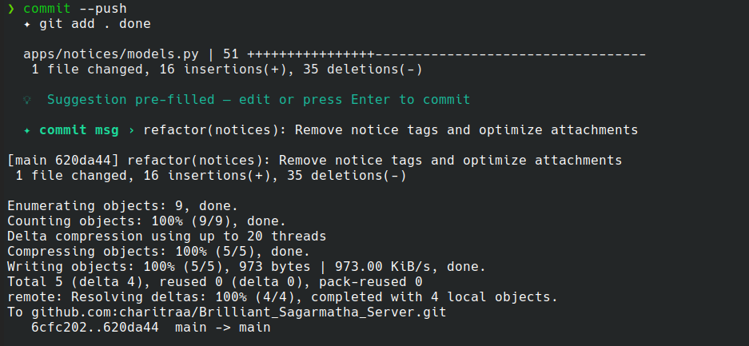
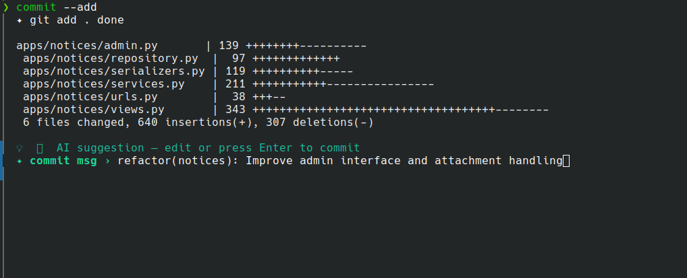

# ✦ suggit — AI-powered Git Commit CLI

> Smart git commit message suggester with pre-filled autocomplete.
> Uses **Google Gemini AI first** (free, no credit card), falls back to a **local engine** if AI is unavailable — works completely offline too.


---
## images




---

## ✨ Features

- 🤖 **AI suggestion** via [Google Gemini](https://aistudio.google.com) — free, no credit card needed
- ⚡ **Local fallback engine** — works offline, zero API needed
- ✏️ **Pre-filled prompt** — suggestion ready to edit or accept with Enter
- 🔁 **Auto git add** — `--add` and `--push` stage files for you
- 📋 **Conventional Commits** format — `type(scope): description`
- 🛡️ **Silent fallback** — rate limit, timeout, no key? local engine kicks in instantly
- 🗂️ **Modular structure** — clean split across 5 files

---

## 📦 Requirements

- Python 3.8+
- Git
- `prompt_toolkit`

```bash
pip install prompt_toolkit --break-system-packages
```

---

## 📁 Project structure

```
suggit/
├── commit.py          ← entry point  (install this to PATH)
├── git_utils.py       ← git helpers  (stage, diff, commit, push)
├── ai_suggest.py      ← Gemini AI    (free API, optional)
├── local_suggest.py   ← local engine (offline, always works)
├── ui.py              ← spinner + interactive prompt
└── README.md
```

---

## 🐧 Linux — Installation

```bash
# 1. Clone the repo
git clone https://github.com/charitraa/suggit.git
cd suggit

# 2. Install dependency
pip install prompt_toolkit --break-system-packages

# 3. Copy all files to /usr/local/bin
sudo cp commit.py git_utils.py ai_suggest.py local_suggest.py ui.py /usr/local/bin/
sudo mv /usr/local/bin/commit.py /usr/local/bin/commit
sudo sed -i 's/\r//' /usr/local/bin/commit
sudo chmod +x /usr/local/bin/commit

# 4. (Optional) Set free Gemini AI key
echo 'export GEMINI_API_KEY="AIza..."' >> ~/.zshrc
source ~/.zshrc
```

---

## 🪟 Windows — Installation

### Option A — PowerShell

```powershell
# 1. Clone the repo
git clone https://github.com/charitraa/suggit.git
cd suggit

# 2. Install dependency
pip install prompt_toolkit

# 3. Create C:\tools\ and copy all files there
mkdir C:\tools
copy *.py C:\tools\

# 4. Create C:\tools\commit.bat
# Content:
#   @echo off
#   python "C:\tools\commit.py" %*

# 5. Add C:\tools to PATH
#    Start → "Edit system environment variables"
#    → Environment Variables → System variables → Path → Edit → New → C:\tools

# 6. (Optional) Set free Gemini AI key — add to $PROFILE:
#    $env:GEMINI_API_KEY = "AIza..."
```

### Option B — WSL

Follow the **Linux installation** steps inside your WSL terminal. Works identically.

---

## 🔑 Free Gemini AI Key (Optional but recommended)

Without a key the local engine runs automatically. With a key you get smarter AI suggestions.

1. Go to 👉 **[aistudio.google.com/apikey](https://aistudio.google.com/apikey)**
2. Sign in with Google → **Create API key** → copy it
3. Add to shell:

**Linux / macOS**
```bash
echo 'export GEMINI_API_KEY="AIza..."' >> ~/.zshrc
source ~/.zshrc
```

**Windows PowerShell**
```powershell
# Add to $PROFILE
$env:GEMINI_API_KEY = "AIza..."
```

**Free tier limits:**

| Model | Requests/min | Requests/day |
|---|---|---|
| `gemini-2.5-flash` | 10 | 500 |
| `gemini-2.5-flash-lite` | 15 | 1500 |

For daily commits that's more than enough — completely free, forever.

---

## 🚀 Usage

```bash
commit              # detect unstaged → ask to stage → suggest → commit
commit --add        # git add . → suggest → commit
commit --push       # git add . → suggest → commit → git push
commit --dry-run    # show suggestion only, don't commit
```

### What it looks like

```
  ✦ git add . done

  apps/notices/views.py    | 343 +++++++++++++++
  apps/notices/services.py | 211 +++++++------

  💡 🤖 AI suggestion — edit or press Enter to commit

  ✦ commit msg › refactor(notices): restructure service layer with caching
   Enter commit   Ctrl+A clear   Ctrl+C cancel
```

If AI is unavailable (rate limit / no key / offline):
```
  💡 ⚡ local suggestion — edit or press Enter to commit
  ✦ commit msg › refactor(notices): refactor notices logic
```

---

## ⚡ Recommended aliases

**Linux — add to `~/.zshrc` or `~/.bashrc`**
```bash
alias ca="commit --add"
alias cap="commit --push"
```

**Windows — add to `$PROFILE`**
```powershell
function ca  { commit --add }
function cap { commit --push }
```

Then just:
```bash
ca     # stage + commit
cap    # stage + commit + push  ← full lazy mode
```

---

## 🧠 How the local engine works

When AI is unavailable, your diff is analysed using **Conventional Commits** rules across 55+ scope patterns:

| What it detects | Example output |
|---|---|
| `test_` / `*.spec.ts` files | `test(auth): add unit tests` |
| `*.md` / `docs/` files | `docs: update readme` |
| New functions/classes in patch | `feat(api): add get_notice, create_notice` |
| More deletions than insertions | `refactor(service): clean up logic` |
| Empty files added | `chore: add empty repository, service files` |
| Files deleted | `chore: remove unused files` |
| Django views/serializers/models | `refactor(views): update notices viewset` |
| React components/hooks/pages | `feat(components): add NoticeCard component` |
| Flutter widgets/blocs | `feat(widgets): add notice list screen` |

Scope is auto-detected from 55+ patterns covering Django, React, Flutter, Node.js and more.

---

## 🛠️ Troubleshooting

| Problem | Fix |
|---|---|
| `ModuleNotFoundError: No module named 'git_utils'` | All 5 `.py` files must be in the same folder — copy them all to `/usr/local/bin/` |
| `command not found: commit` | Make sure `/usr/local/bin` is in PATH |
| Script prints garbage on run | Run `sudo sed -i 's/\r//' /usr/local/bin/commit` (CRLF fix) |
| `ModuleNotFoundError: prompt_toolkit` | Run `pip install prompt_toolkit --break-system-packages` |
| AI always falls back to local | Run `echo $GEMINI_API_KEY` — if empty, run `source ~/.zshrc` |
| `commit` conflicts with another command | Rename: `sudo mv /usr/local/bin/commit /usr/local/bin/aicommit` |
| Gemini key expired | Get a new key at [aistudio.google.com/apikey](https://aistudio.google.com/apikey) |

---

## 📄 License

MIT — free to use, modify, and distribute.

---

Made with ❤️ by [Charitra](https://github.com/charitraa)
